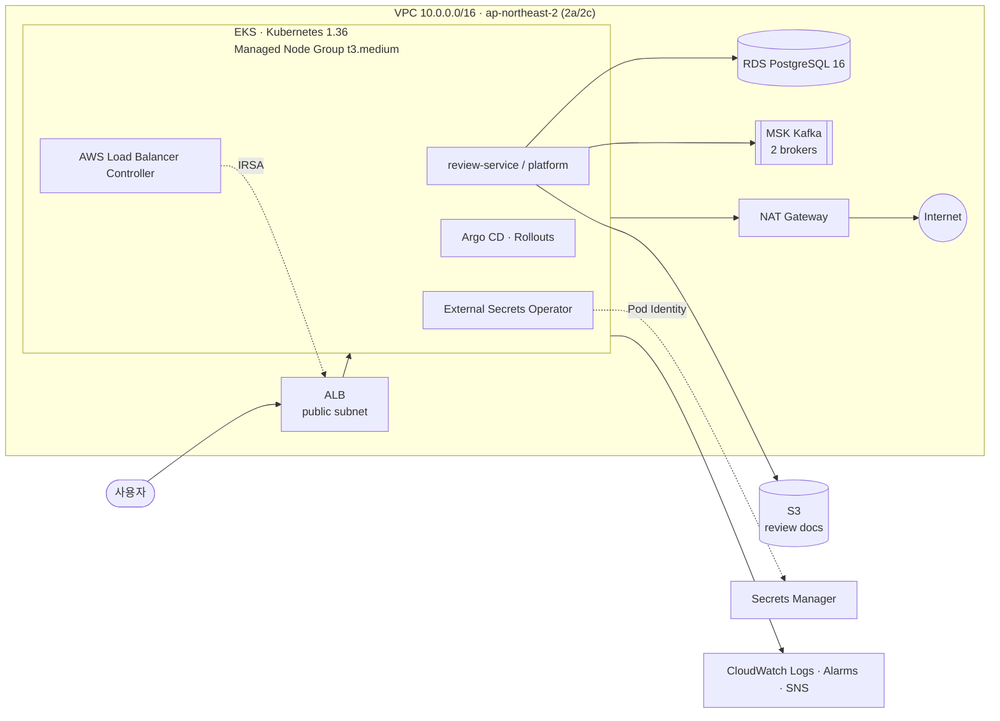

# oneaction-infra

oneaction 서비스의 AWS 인프라를 정의한 Terraform 코드입니다. 네트워크부터 EKS, 데이터 계층, 시크릿 동기화까지 스택 단위로 나눠 관리하며, 애플리케이션 배포는 별도 GitOps 저장소의 Argo CD가 담당합니다.

> 공개용 저장소입니다. AWS 계정 ID·Secret ARN·리소스 주소는 예시값(`123456789012` 등)으로 바꿨고, 운영 기록 문서는 제외했습니다.

## 아키텍처



## 스택 구성

각 스택은 독립된 Terraform 상태(`dev/<stack>/terraform.tfstate`)를 가지며, 앞 스택의 output을 `terraform_remote_state`로 참조합니다.

| 순서 | 스택 | 주요 리소스 |
| --- | --- | --- |
| 1 | [`network`](infra/network) | VPC, public·EKS·data 서브넷(2 AZ), NAT Gateway, S3 Gateway Endpoint, ALB·RDS·노드 보안그룹 |
| 2 | [`storage`](infra/storage) | 리뷰 문서 버킷(버전 관리·암호화), 로그 버킷(수명 주기), 퍼블릭 접근 차단 |
| 3 | [`dns`](infra/dns) | Route 53 호스팅 영역, ACM 인증서, CAA 레코드, 쿼리 로그 |
| 4 | [`database`](infra/database) | RDS PostgreSQL 16 (`db.t4g.micro`, 암호화, 마스터 비밀번호는 Secrets Manager 관리) |
| 5 | [`alb`](infra/alb) | ALB, HTTP/HTTPS 리스너, 플랫폼 대상 그룹 |
| 6 | [`observability`](infra/observability) | VPC Flow Logs, EKS 로그 그룹, RDS·ALB·NAT 알람, SNS 알림 |
| 7 | [`eks`](infra/eks) | EKS 클러스터, Launch Template 기반 Node Group, OIDC, VPC CNI 전용 IRSA, Access Entry |
| 8 | [`eks-lbc`](infra/eks-lbc) | AWS Load Balancer Controller용 IRSA 역할·정책, Helm values |
| 9 | [`eks-eso`](infra/eks-eso) | External Secrets Operator용 Pod Identity, Secret별 최소 읽기 정책 |
| 10 | [`msk`](infra/msk) | MSK Kafka 클러스터(`kafka.t3.small` × 2), EKS 서브넷에서만 허용하는 보안그룹 |

## 설계 포인트

- **스택 분리**: 변경 범위와 장애 영향을 줄이기 위해 리소스 수명 주기별로 상태를 나눴습니다. EKS 애드온(LBC, ESO)도 클러스터 스택과 분리했습니다.
- **최소 권한**: LBC는 IRSA, ESO는 EKS Pod Identity를 사용하고 읽을 수 있는 Secret을 ARN 단위로 제한합니다. Argo CD Notifications도 전용 역할을 따로 둡니다.
- **시크릿은 코드 밖에**: RDS 비밀번호, GitOps 토큰, API 키는 Secrets Manager에만 저장하고 ESO가 Kubernetes Secret으로 동기화합니다. Terraform은 Secret 메타데이터만 조회합니다.
- **네트워크 격리**: RDS와 MSK는 data 서브넷에 두고, EKS 서브넷 CIDR에서만 접근을 허용합니다. EKS API의 퍼블릭 엔드포인트는 `/32` allowlist로 제한합니다.
- **검증 자동화**: 스택마다 `terraform plan` JSON과 Helm 렌더 결과를 검사하는 스크립트(`scripts/check_*.py`, `Test-*.ps1`)를 둬서 계정·리전·권한 범위가 의도와 다르면 적용 전에 실패하도록 했습니다.

## 실행 방법

사전 요구사항: Terraform 1.5.7, AWS CLI v2, (EKS 애드온 설치 시) kubectl, Helm

```bash
# 1. 상태 저장용 S3 버킷·DynamoDB 잠금 테이블 이름을 infra/backend.hcl에 맞게 수정
# 2. 스택 순서대로 실행
cd infra/network
terraform init -backend-config=../backend.hcl
terraform plan -out=tfplan
terraform apply tfplan
```

EKS 관련 스택의 상세 절차와 변수는 각 디렉터리의 README를 참고하세요.

- [infra/README.md](infra/README.md) — 공통 전제와 적용 순서
- [infra/eks/README.md](infra/eks/README.md) — 클러스터 구성과 선택 근거
- [infra/eks-lbc/README.md](infra/eks-lbc/README.md) — Load Balancer Controller 설치
- [infra/eks-eso/README.md](infra/eks-eso/README.md) — 시크릿 동기화 구성

## 기술 스택

Terraform 1.5.7 · AWS provider 5.x · Amazon EKS · RDS for PostgreSQL · Amazon MSK · ALB · Route 53 · ACM · S3 · Secrets Manager · CloudWatch · External Secrets Operator · AWS Load Balancer Controller · Argo CD
